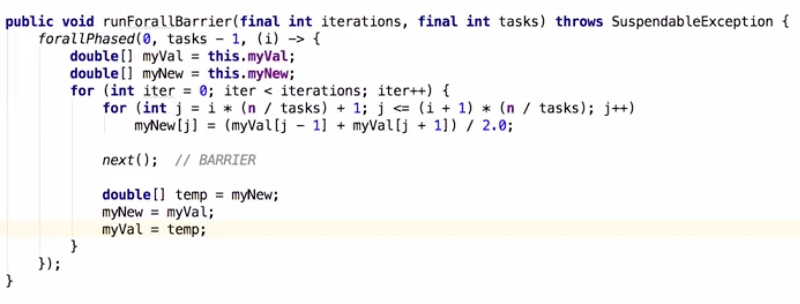

Table of Contents
=================

   * [Loop Parallelism](#loop-parallelism)
      * [Parallel Matrix Multiplication](#parallel-matrix-multiplication)
      * [Barriers in Parallel Loops](#barriers-in-parallel-loops)
         * [One-Dimensional Iterative Averaging](#one-dimensional-iterative-averaging)
      * [Iteration Grouping: Chunking of Parallel Loops](#iteration-grouping-chunking-of-parallel-loops)

# Loop Parallelism

In this lecture, we learned different ways of expressing parallel loops. The most general way is to think of each iteration of a parallel loop as an async task, with a finish construct encompassing all iterations. This approach can support general cases such as parallelization of the following pointer-chasing while loop (in pseudocode):

```Java
finish {
for (p = head; p != null ; p = p.next) async compute(p);
}
```

However, further efficiencies can be gained by paying attention to counted-for loops for which the number of iterations is known on entry to the loop (before the loop executes its first iteration). We then learned the forall notation for expressing parallel counted-for loops, such as in the following vector addition statement (in pseudocode):

```Java
forall (i : [0:n-1]) 
    a[i] = b[i] + c[i]
```


We also discussed the fact that Java streams can be an elegant way of specifying parallel loop computations that produce a single output array, e.g., by rewriting the vector addition statement as follows:

```Java
a = IntStream.rangeClosed(0, N-1).parallel().toArray(i -> b[i] + c[i]);
```

## Parallel Matrix Multiplication
In this lecture, we reminded ourselves of the formula for multiplying two n × n matrices, a and b, to obtain a product matrix, c, of 
$$ C_{ij} = \sum^{n-1}_{k=0}a_{ik} * b_{kj}$$

This formula can be easily translated to a simple sequential algorithm for matrix multiplication as follows (with pseudocode for counted-for loops):

```Java
for(i : [0:n-1]) {
  for(j : [0:n-1]) { 
    c[i][j] = 0;
    // seq
    for(k : [0:n-1]) {
      c[i][j] = c[i][j] + a[i][k]*b[k][j]
    }
  }
```
}

Upon a close inspection, we can see that it is safe to convert for-i and for-j into forall loops, but for-k must remain a sequential loop to avoid data races.


## Barriers in Parallel Loops

In this lecture, we learned the barrier construct through a simple example that began with the following forall parallel loop (in pseudocode):

```Java
forall (i : [0:n-1]) {
        myId = lookup(i); // convert int to a string 
        print HELLO, myId;
        // barriers 
        print BYE, myId;
}
```

We discussed the fact that the HELLO’s and BYE’s from different forall iterations may be interleaved in the printed output, e.g., some HELLO’s may follow some BYE’s. Then, we showed how inserting a **barrier** between the two print statements could ensure that _all HELLO’s would be printed before any BYE’s_.

Thus, **barriers extend a parallel loop by dividing its execution into a sequence of phases**. While it may be possible to write a separate forall loop for each phase, it is both more convenient and more efficient to instead insert barriers in a single forall loop, e.g., we would need to create an intermediate data structure to communicate the myId values from one forall to another forall if we split the above forall into two (using the notation next) loops. Barriers are a fundamental construct for parallel loops that are used in a majority of real-world parallel applications.


### One-Dimensional Iterative Averaging

In this lecture, we discussed a simple stencil computation to solve the recurrence, $x_{i} = \frac{x_{i-1} + x_{i+1}}{2}$ with boundary conditions, $x_{0} = 0$ and $x_{1} = 1$.

```Python
import random

a = [random.randint(0,1) for i in range(11)]
print(a)

for i in range(1001):
    new = [0]
    for j in range(1,len(a)-1):
        new.append((a[j-1] + a[j+1]) / 2.0)
    new.append(1)
    a = new

print(a)

# [1, 1, 1, 1, 1, 0, 1, 0, 1, 0, 0]
# [0, 0.10000000000000017, 0.19999999999999973, 0.3000000000000005, 0.3999999999999995, 0.5000000000000007, 0.5999999999999994, 0.7000000000000006, 0.7999999999999996, 0.9000000000000002, 1]
```


A naive approach to parallelizing this method would result in the following pseudocode:

```Java
for (iter: [0:nsteps-1]) {
  forall (i: [1:n-1]) {
    newX[i] = (oldX[i-1] + oldX[i+1]) / 2;
  }
  swap pointers newX and oldX;
}
```


Though easy to understand, this approach creates nsteps × (n − 1) tasks, which is too many. **Barriers can help reduce the number of tasks created as follows**:

```Java
forall ( i: [1:n-1]) {
  for (iter: [0:nsteps-1]) {
    newX[i] = (oldX[i-1] + oldX[i+1]) / 2;
    NEXT; // Barrier
    swap pointers newX and oldX;
  }
}
```

In this case, only (n − 1) tasks are created, and there are nsteps barrier (next) operations, each of which involves all (n − 1) tasks. This is a significant improvement since creating tasks is usually more expensive than performing barrier operations.


## Iteration Grouping: Chunking of Parallel Loops
We observed that this approach creates n tasks, one per forall iteration, which is wasteful when (as is common in practice) n is much larger than the number of available processor cores.

```Java
forall (i : [0:n-1]) a[i] = b[i] + c[i]
```

To address this problem, we learned a common tactic used in practice that is referred to as loop chunking or iteration grouping, and focuses on reducing the number of tasks created to be closer to the number of processor cores, so as to reduce the overhead of parallel execution:

With iteration grouping/chunking, the parallel vector addition example above can be rewritten as follows:

```Java
forall (g:[0:ng-1])
  for (i : mygroup(g, ng, [0:n-1])) a[i] = b[i] + c[i]
```


Note that we have reduced the degree of parallelism from n to the number of groups, **ng**, which now equals the number of iterations/tasks in the forall construct.


There are two well known approaches for iteration grouping: **block** and **cyclic**. The former approach (block) maps consecutive iterations to the same group, whereas the latter approach (cyclic) maps iterations in the same congruence class (mod ng) to the same group. With these concepts, you should now have a better understanding of how to execute forall loops in practice with lower overhead.



